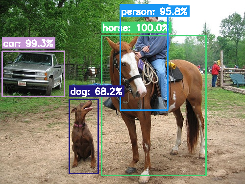

# 👁️ Building the Machine's Optic Nerve
### Project 4 (Optional Mastery) | Decode Labs AI Internship | Batch 2026
### Image & Text Recognition — OCR + Object Detection

> *"To a machine, an image is not a picture; it is a massive three-dimensional array."*
> — Decode Labs Architect's Playbook

---

## 📌 Project Overview

This is the **optional mastery milestone** of the Decode Labs AI Internship. Where Projects 1–3 worked with structured data (text, CSVs), Project 4 crosses the paradigm shift into **unstructured visual data** — the over 80% of enterprise data that lives in scanned documents, photos, and video feeds.

This submission implements **both execution paths** from the Architect's Playbook:

| Path | Task | Library | Output |
|---|---|---|---|
| **Path 1** | Optical Character Recognition (OCR) | `pytesseract` | Machine-readable text strings |
| **Path 2** | Object Detection | `cv2.dnn` + MobileNet-SSD | (X, Y, W, H) bounding boxes |

| Field         | Details                                        |
|---------------|------------------------------------------------|
| **Intern**    | Kanwal Fatima                                  |
| **Track**     | Artificial Intelligence (AI)                   |
| **Company**   | Decode Labs (`decodelabs.tech`)               |
| **Language**  | Python 3.12                                    |
| **CV Engine** | OpenCV 4.13 (`cv2.dnn`)                        |
| **OCR Engine**| Tesseract 5.3.4 (`pytesseract`)                |
| **Model**     | MobileNet-SSD (Caffe, VOC-trained, transfer learning) |

---

## 🏗️ Architecture — The IPO Model for Vision

```
INPUT                    →     PROCESS                    →     OUTPUT
   │                              │                                │
Raw image as a               Pre-processing /              Validated, labeled
3D array (H×W×3,             Blob construction +           result — text string
values 0-255)                forward pass through          or bounding boxes
                              pre-trained network           (80% confidence gate)
```

A single 512×512 image generates **786,432 individual data points**. Both pipelines below exist to extract *meaning* from that array.

---

## 🔬 Path 1: Optical Character Recognition

### The Logic Skeleton (4-step pre-processing)

```
Step 1: Grayscale       Step 2: Gaussian Blur      Step 3: Deskew           Step 4: Adaptive Threshold
3D RGB → 1D intensity    Eliminate noise/artifacts   Hough-line median        Otsu's Method — forces
matrix                                               angle correction         every pixel to pure B/W
```

**Why each step matters:**
- **Grayscale** — removes distracting color data Tesseract doesn't need
- **Gaussian Blur** — smooths shadows and chromatic scan noise
- **Deskew** — uses **Hough Line Transform** on detected edges, taking the *median angle* across all near-horizontal lines. This is more robust against noisy real-world scans than a single bounding-box angle, which can hit ambiguous ±90° edge cases on full-page blobs.
- **Adaptive Threshold (Otsu)** — `IF pixel >= cutoff: white ELSE: black` — perfect contrast for character contours

### PSM Tuning (Page Segmentation Mode)
| Mode | Use Case |
|---|---|
| `--psm 3` | Fully automatic (varied layouts) |
| `--psm 6` | Single uniform block (documents/invoices) ← **used here** |
| `--psm 7` | Single text line (plates/headers) |
| `--psm 11` | Sparse, scattered text |

### Results

| Test Image | Condition | Deskew Detected | Confidence | Gate |
|---|---|---|---|---|
| `clean_invoice.png` | Clean baseline | — | **93.6%** | ✅ PASS |
| `scanned_invoice_noisy.png` | Noise + 4.5° skew | -4.37° (47 edges) | **89.6%** | ✅ PASS |
| `tilted_text_line.png` | Clean text, 12° skew | 11.97° (6 edges) | **93.8%** | ✅ PASS |

**Before / After — noisy skewed invoice → clean recognized text:**


**Extracted text** (`scanned_invoice_noisy.png`):
```
INVOICE #0042
DATE: 2026-06-17
ITEM: SERVER RACK UNIT
QTY: 3
UNIT PRICE: $449.00
SUBTOTAL: $1347.00
TAX (8%): $107.76
TOTAL: $1454.76
```

---

## 🎯 Path 2: Object Detection (MobileNet-SSD)

### Transfer Learning — "Why train an AI from scratch when you can download a degree?"

This pipeline leverages **MobileNet-SSD**, pre-trained on millions of ImageNet images to understand universal visual concepts (edges, shapes, gradients), then fine-tuned on the **PASCAL VOC** dataset (20 object classes). We never train from scratch — we attach a plug-and-play output layer to an already-intelligent backbone.

### The Pipeline

```
1. Blob Construction        2. SSD Forward Pass         3. Softmax Decode        4. The 80% Gate
cv2.dnn.blobFromImage        Single-shot detection        Raw scores → per-       if conf >= 0.80:
300×300, mean subtraction    (not multiple passes)        class probabilities      draw_box_and_label()
                                                                                    else: drop_detection()
```

**Why MobileNet-SSD?** It uses **depthwise separable convolutions**, optimized for real-time inference on edge devices with minimal compute — exactly the kind of lightweight model an intern's laptop can run.

**Why SSD over older detectors?** Old detectors needed multiple passes per image. SSD classifies AND localizes in a single forward pass.

### Results — `test_object_scene.jpg`

| Object | Confidence | Bounding Box (X,Y,W,H) | Gate |
|---|---|---|---|
| horse | **100.0%** | (207, 72, 213, 285) | ✅ PASS |
| car | **99.3%** | (4, 104, 127, 92) | ✅ PASS |
| person | **95.8%** | (245, 9, 97, 215) | ✅ PASS |
| dog | 68.2% | — | ❌ dropped (below 80%) |
| bird | 46.0% | — | ❌ dropped (below 80%) |



The dog in the scene was correctly detected by the network but **dropped by the 80% Gate** — a deliberate demonstration of the confidence filter doing its job. This is the core tradeoff from the Architect's Playbook: *high thresholds minimize false positives but increase the risk of false negatives.*

---

## ✅ The Gatekeeper Rule — Milestone Validation

| # | Validation | Status | Evidence |
|---|---|---|---|
| 1 | **Library Integration** | ✅ | Seamless, error-free `pytesseract` + `cv2.dnn` implementation |
| 2 | **Pre-Processing Integrity** | ✅ | Demonstrable Grayscale + Gaussian Blur + Deskew + Adaptive (Otsu) Threshold |
| 3 | **Accuracy Benchmarking** | ✅ | Min. validated confidence ≥ 80% on all final outputs (89.6%–100%) |
| 4 | **Visual Confirmation** | ✅ | Legible OCR text + accurate labeled bounding boxes (saved to `output/`) |

---

## 📂 Project Structure

```
project4_recognition/
│
├── ocr_recognition.py              # Path 1: full OCR pipeline
├── object_detection.py             # Path 2: MobileNet-SSD detection
│
├── models/
│   ├── deploy.prototxt             # MobileNet-SSD architecture definition
│   └── mobilenet_iter_73000.caffemodel   # Pre-trained VOC weights
│
├── sample_images/
│   ├── clean_invoice.png           # Baseline OCR test (no degradation)
│   ├── scanned_invoice_noisy.png   # Noisy + skewed OCR stress test
│   ├── tilted_text_line.png        # Clean deskew validation test
│   └── test_object_scene.jpg       # Multi-object detection test (PASCAL VOC)
│
├── output/                         # Generated visual proof (gitignored if large)
├── README.md
└── requirements.txt
```

---

## 🚀 How to Run

### Requirements
```bash
sudo apt-get install tesseract-ocr     # Tesseract OCR engine binary
pip install -r requirements.txt
```

`requirements.txt`:
```
opencv-python
pytesseract
numpy
```

### Path 1 — OCR
```bash
python ocr_recognition.py sample_images/scanned_invoice_noisy.png --psm 6
```

### Path 2 — Object Detection
```bash
python object_detection.py sample_images/test_object_scene.jpg
```

Optional: adjust the confidence gate —
```bash
python object_detection.py sample_images/test_object_scene.jpg --threshold 0.60
```

---

## 🔑 Model Source

`deploy.prototxt` and `mobilenet_iter_73000.caffemodel` are the open-source **chuanqi305/MobileNet-SSD** Caffe weights, trained on PASCAL VOC. Test scene image sourced from the same repository's bundled VOC examples.

---

## 🎓 Learning Outcomes

- ✅ Understood images as 3D numerical arrays, not "pictures"
- ✅ Built a complete OCR pre-processing pipeline (grayscale → blur → deskew → threshold)
- ✅ Applied Hough Line Transform for robust skew-angle detection
- ✅ Used Transfer Learning to deploy a pre-trained CNN without training from scratch
- ✅ Implemented Blob Construction for `cv2.dnn` inference
- ✅ Understood Softmax confidence scores and applied a hard 80% gate
- ✅ Decoded normalized bounding-box coordinates back into pixel space

---

## 👩‍💻 Author

**Kanwal Fatima**
AI Student | Software Developer
📧 kanwal.ai.pk@gmail.com
🔗 [LinkedIn](https://www.linkedin.com/in/kanwal-fatima-72a352357/)
🐙 [GitHub](https://github.com/KanwalAi)

---

## 🏢 About Decode Labs

**Decode Labs** — Your Digital Lab
🌐 [www.decodelabs.tech](https://www.decodelabs.tech)
✉️ hr@decodelabs.tech
📍 Greater Lucknow, India

---

*Project 4 of 4 — Image & Text Recognition | Decode Labs AI Internship 2026*
